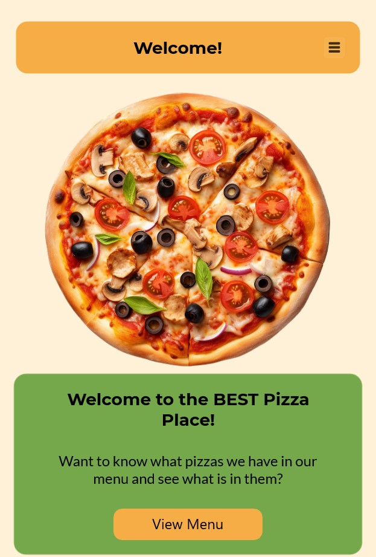

# Pizza Place 🍕
**Pizza Place** on .NET MAUI rakendus, mis võimaldab kasutajatel sirvida ja hallata pitsa menüüd.

---

## 🎯 Projekti eesmärk
PizzaPlace eesmärk on:
- Näidata kasutajatele erinevaid pitsasid koos detailse informatsiooniga (koostisosad, suurus, hind jne).
- Anda võimalus lisada, muuta ja kustutada pitsasid.
- Pakkuda sujuvat navigeerimist erinevate lehtede vahel.

---

## 🚀 Funktsionaalsused
- **StartPage**: Tervitab kasutajat ja pakub võimalust menüüd sirvida.
- **PizzaMenu**: Kuvab kõik saadaval olevad pitsad.
- **PizzaDetails**: Kuvab valitud pitsa detailid.
- **PizzaCreateUpdate**: Võimaldab lisada või muuta pitsa andmeid.
- **Navigeerimine**: Lihtne ja kiire navigeerimine erinevate lehtede vahel.

---

## 🛠️ Tehnoloogiad
- **.NET MAUI**: Platvormiülene raamistik mobiili- ja töölauarakenduste loomiseks.
- **C#**: Peamine programmeerimiskeel.
- **SQLite**: Andmebaas pitsa andmete salvestamiseks.
- **XAML**: Kasutajaliidese kujundamiseks.

---

## 📂 Projekti struktuur
- **Views**: Sisaldab rakenduse erinevaid lehti (nt StartPage, PizzaMenu, PizzaDetails).
- **Models**: Andmemudelid, nagu `Pizza`.
- **Data**: Andmebaasi haldamine ja andmete päringud.
- **Resources**: Rakenduse ressursid, nagu pildid ja stiilid.

---

## 📸 Ekraanipildid
### Start Page

### Pizza Menu

### Pizza Details

### Pizza Create/Update

---

## 👩‍💻 Arendus meeskond
- Kati Koppel
- Anna Fomina
- Kevin Randla
- Orvet Priimägi

---

